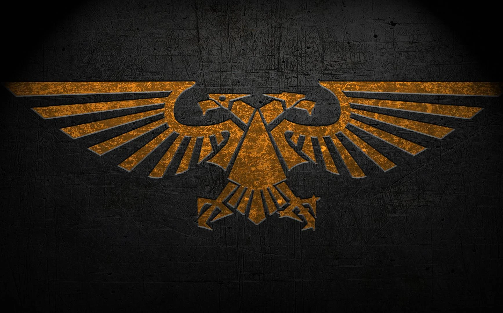

# Imperial Terminal Configuration

<div align="center">
  
</div>

---

## Overview

Transform your Linux terminal into an **Imperial Command Terminal**.

## Compatibility

This configuration supports:

- **Zsh** (`.zshrc`) - Recommended for Space Marine Lieutenants
- **Bash** (`.bashrc`) - Suitable for Imperial Guard officers
- **Other POSIX shells** - With minor modifications

## Features

### Sacred Terminal Interface

- **Dynamic Chapter system** - Choose your Space Marine Chapter with authentic colors
- **Imperial dating system** - M41/M42 timeline with proper Imperial format
- **Rank progression** - Advance from Battle-Brother to Chapter Master based on system usage
- **Phosphor green terminal colors** - Authentic Imperial cogitator aesthetics
- **Real-time chronometer** - Imperial date and time display
- **Contextual messages** - Different greetings based on time of day

### Combat-Ready Aliases

#### System Purification Commands

```bash
purify-system        # System updates with Imperial ceremony
cleanse-heresy       # Remove heretical packages with blessing
install-sacred       # Install new software packages
sacred-logs          # Monitor system logs with sacred protocols
system-status        # Check service status
monitor-machine      # System resource monitoring with machine spirit
```

#### Reconnaissance Operations

```bash
recon-scan           # Network discovery with warp storm checks
full-augury          # Complete network analysis
stealth-probe        # Stealthy reconnaissance operations
deep-scan            # Vulnerability assessment with Imperial protocols
active-channels      # Monitor listening ports
external-position    # Check external IP coordinates
```

#### Data Management Protocols

```bash
list-data            # Enhanced directory listing with Imperial formatting
inscribe             # Sacred text editor (nano)
duplicate            # File duplication protocols
relocate             # Data relocation operations
purge                # Secure deletion with Imperial blessing
compress/extract     # Archive operations with ritual
```

### Imperial Functions & Rituals

Execute these sacred rituals:

```bash
praise-omnissiah     # Mechanicus blessing with system uptime
binary-prayer        # Emperor's protection in sacred binary
machine-blessing     # Complete machine spirit ritual with ceremony
emperor-blessing     # Full Imperial benediction
chapter-oath         # Recite your Chapter's sacred oath
imperial-status      # Complete status report with Imperial formatting
help-imperial        # Complete command reference with sacred knowledge
```

### Chapter System

Choose from authentic Space Marine Chapters:

| Chapter | Colors | Symbol | Battle Cry |
|---------|--------|--------|------------|
| **Ultramarines** | Blue/Gold | ☩ | "Courage and Honour!" |
| **Blood Angels** | Red/Gold | ⸸ | "For Sanguinius and the Emperor!" |
| **Dark Angels** | Dark Green/Bone | ⚔ | "Repent! For tomorrow you die!" |
| **Space Wolves** | Grey/Orange | 🐺 | "For Russ and the Allfather!" |
| **Imperial Fists** | Yellow/Black | ✊ | "Primarch-Progenitor, to your glory!" |

Each Chapter includes:

- Authentic color schemes
- Chapter-specific mottos and battle cries
- Unique terminal aesthetics
- Lore-accurate symbolism

## Installation

### For Zsh Users (Recommended)

```bash
# Backup your current configuration
cp ~/.zshrc ~/.zshrc.backup

# Replace with Imperial configuration
cp imperial-zshrc ~/.zshrc

# Reload your shell
source ~/.zshrc
```

### For Bash Users

```bash
# Backup your current configuration
cp ~/.bashrc ~/.bashrc.backup

# Replace with Imperial configuration
cp imperial-zshrc ~/.bashrc

# Reload your shell
source ~/.bashrc
```

### Dependencies

Install these sacred components:

```bash
# Ubuntu/Debian systems
sudo apt install curl htop nmap bc

# Optional: Matrix rain effect for machine spirit
sudo apt install cmatrix

# Optional: Hollywood-style data streams
sudo apt install hollywood
```

## Chapter Configuration

### Personal Chapter Setup

```bash
# Edit your Chapter configuration
chapter-config

# Available settings:
IMPERIAL_CHAPTER="BLOOD_ANGELS"    # Choose your Chapter
COMPANY="3rd Company"              # Your Company assignment  
SQUAD="Assault Squad Dante"        # Your Squad designation
BATTLE_HONORS=("Armageddon" "Baal") # Your battle honors
```

### Custom Chapter Creation

Add your own Chapter by modifying the case statement in the configuration:

```bash
"YOUR_CHAPTER")
    PRIMARY_COLOR="\033[38;2;R;G;Bm"     # Your colors
    CHAPTER_SYMBOL="⚡"                   # Your symbol
    BATTLE_CRY="Your battle cry!"        # Your cry
    CHAPTER_MOTTO="Your motto"           # Your motto
    ;;
```

## Advanced Features

### Imperial Dating System

The terminal displays dates in proper M41/M42 format:

- **M42.025.147.1430** - 42nd Millennium, year 025, day 147, time 14:30

### Rank Progression System

Your rank advances based on system usage:

- **Battle-Brother** - New recruits
- **Veteran** - 7+ days uptime, 50+ logins  
- **Sergeant** - 30+ days uptime, 200+ logins
- **Captain** - 100+ days uptime, 500+ logins
- **Chapter Master** - 365+ days uptime, 1000+ logins

### Random Events

- **Warp Storm Warnings** - Rare events during network operations (0.5% chance)
- **Imperial Blessings** - Random wisdom at startup
- **Heresy Detection** - Humorous warnings about recreational processes

### Contextual Intelligence

- **Dawn Patrol** messages in the morning
- **Night Watch** notifications during late hours
- **Midday Observance** reminders during lunch

## Community Integration

This configuration appeals to different Warhammer 40K community segments:

- **Lore Masters** - Authentic Imperial terminology and references
- **Tabletop Players** - Chapter customization matching your army
- **Video Game Fans** - Immersive command-line RPG experience  
- **System Administrators** - Professional tools with thematic flair
- **Collectors** - Complete aesthetic consistency

## Advanced Usage Examples

### Daily Imperial Ritual

```bash
# Morning purification sequence
purify-system && cleanse-heresy && imperial-status

# Evening blessing
emperor-blessing && machine-blessing
```

### Network Reconnaissance Mission

```bash
# Complete reconnaissance protocol
recon-scan 192.168.1.0/24
full-augury suspicious-target.local
deep-scan --target-validation required
```

### Chapter Brotherhood Commands

```bash
# Display Chapter information
chapter-oath && imperial-status

# Perform machine spirit blessing
machine-blessing && praise-omnissiah
```

## Troubleshooting

### Common Imperial Issues

**Colors not displaying properly:**

```bash
# Verify terminal capabilities
echo $TERM
# Should support 256 colors
```

**Chapter configuration not loading:**

```bash
# Recreate configuration file
rm ~/.imperial_chapter_config
source ~/.zshrc  # Will auto-create new config
```

**Machine spirit corruption (shell errors):**

```bash
# Emergency restoration protocol
cp ~/.zshrc.backup ~/.zshrc && source ~/.zshrc
emperor-blessing  # Restore Imperial favor
```

### Performance Optimization

- Uses minimal system resources
- Efficient prompt updates with TMOUT
- Cached function results where possible
- Clean error handling prevents terminal hangs

## Contributing to the Imperium

Submit your improvements:

- Additional Space Marine Chapters
- New Imperial-themed aliases
- Enhanced ASCII art and symbols
- Lore-accurate improvements
- Performance optimizations

### Development Guidelines

- Maintain lore accuracy
- Ensure cross-platform compatibility
- Test on both Zsh and Bash
- Document all functions thoroughly
- Follow Imperial coding standards (clean, functional, blessed by the Omnissiah)

## File Structure

```
~/.zshrc                    # Main Imperial configuration
~/.imperial_chapter_config  # Chapter-specific settings
~/.zsh_history             # Imperial command history (sacred records)
```

## Security Considerations

All aliases and functions use standard system commands with thematic naming. No actual security vulnerabilities are introduced - this is purely aesthetic enhancement for your development workflow.

## License

This configuration is distributed under the Imperial Truth License. May it serve you well in the defense of humanity against the enemies of the Imperium.

**The Emperor Protects Those Who Serve**

---

<div align="center">
  <h2><strong>FOR THE EMPEROR</strong></h2>
</div>
