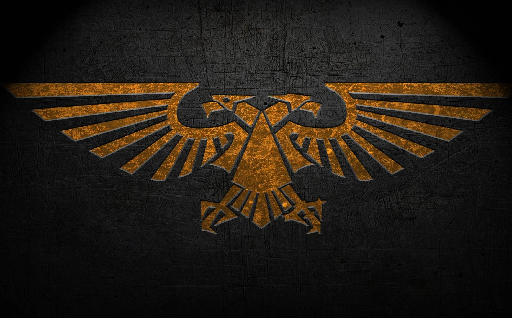

# Imperial Terminal Configuration

<div align="center">
  
</div>

---

## Overview

Transform your Linux terminal into an **Imperial Command Terminal** themed around Warhammer 40K: dynamic prompt, startup banner, ~50 commands as aliases / functions, and 5 playable chapters (Ultramarines, Blood Angels, Dark Angels, Space Wolves, Imperial Fists).

> 🇫🇷 Documentation française : [README.md](README.md)

## Compatibility

- **Zsh** (`.zshrc`) — recommended, full support (prompt, dynamic right prompt, `setopt HIST_*`)
- **Bash** (`.bashrc`) — functions and aliases work; zsh-specific blocks (PROMPT, RPROMPT, TRAPALRM, setopt) are gated behind `[[ -n $ZSH_VERSION ]]`, so bash stays clean (no errors)
- **Platforms**: Linux primarily (uses `/proc/uptime`, `apt`, `pgrep`, `ss`, `nmap`). Most things still run on macOS/BSD, but aliases calling `apt` or `uptime -p` will fail.

## Installation

```bash
# 1. Back up the existing config
cp ~/.zshrc ~/.zshrc.backup

# 2. Install the imperial configuration
cp warhammer_file.sh ~/.zshrc
source ~/.zshrc
```

On first launch, `~/.imperial_chapter_config` is created automatically (and read **before** the banner renders, so your customized chapter shows up from the first shell).

### Dependencies

```bash
# Ubuntu / Debian
sudo apt install curl htop nmap iproute2 procps

# Oh My Zsh plugins (loaded from plugins=(...))
git clone https://github.com/zsh-users/zsh-autosuggestions     ${ZSH_CUSTOM:-~/.oh-my-zsh/custom}/plugins/zsh-autosuggestions
git clone https://github.com/zsh-users/zsh-syntax-highlighting ${ZSH_CUSTOM:-~/.oh-my-zsh/custom}/plugins/zsh-syntax-highlighting

# Optional visual effects
sudo apt install cmatrix hollywood
```

## Chapter system

`$IMPERIAL_CHAPTER` selects colors, symbol, battle cry, and motto:

| Chapter | Colors | Symbol | Battle cry |
|---|---|:---:|---|
| **ULTRAMARINES** *(default)* | Blue / Gold | ☩ | "COURAGE AND HONOUR!" |
| **BLOOD_ANGELS** | Blood red / Gold | ⸸ | "FOR SANGUINIUS AND THE EMPEROR!" |
| **DARK_ANGELS** | Dark green / Bone | ⚔ | "REPENT! FOR TOMORROW YOU DIE!" |
| **SPACE_WOLVES** | Grey / Orange | 🐺 | "FOR RUSS AND THE ALLFATHER!" |
| **IMPERIAL_FISTS** | Yellow / Black | ✊ | "PRIMARCH-PROGENITOR, TO YOUR GLORY!" |

To switch chapter:
```bash
chapter-config         # opens ~/.imperial_chapter_config in nano
# change IMPERIAL_CHAPTER="BLOOD_ANGELS", then:
reload-config          # re-sources without the banner
```

## Imperial date

Format `M42.NNN.DDD.HHMM`:

| Segment | Meaning |
|---|---|
| `M42` | 42nd millennium (current 40K era; M42.026 ≈ 2026 AD) |
| `NNN` | year within the millennium (3 digits) |
| `DDD` | day-of-year (Julian) |
| `HHMM` | 24-hour time |

Example: `M42.026.135.1430` = year 026 of M42, day 135, 14:30.

## Rank system

Derived from the machine's uptime (read from `/proc/uptime`):

| Uptime | Rank |
|---:|---|
| 0–6 days | BATTLE-BROTHER |
| 7–29 d | VETERAN |
| 30–99 d | SERGEANT |
| 100–364 d | CAPTAIN |
| 365+ d | CHAPTER-MASTER |

## Startup banner

Shown **once per interactive shell**. Skipped when:

- `IMPERIAL_QUIET=1` is exported (useful for CI / non-interactive SSH)
- The shell is non-interactive (scripts, `bash -c`, etc.)
- The file is re-sourced in the same session (e.g. through `reload-config`)

The initial `clear` only runs at the outermost shell level (`$SHLVL ≤ 1`), so it never wipes scrollback inside tmux or an editor's `:!sh`.

## Environment variables

| Variable | Effect |
|---|---|
| `IMPERIAL_QUIET=1` | Skip the startup banner |
| `IMPERIAL_AUTHORIZED=1` | **Unblocks the nmap aliases.** Use only against networks you own or have written permission to scan. |
| `IMPERIAL_CHAPTER` | Chapter token. Normally loaded from `~/.imperial_chapter_config`. |
| `IMPERIAL_BANNER_SHOWN` | Internal. Set to `1` once the banner has rendered, prevents replay. |

## Full command reference

### Rituals & status

| Command | Effect |
|---|---|
| `praise-omnissiah` | Mechanicus blessing + uptime |
| `binary-prayer` | "Emperor protects" in binary |
| `machine-blessing` | Animated blessing ritual (~12s) |
| `emperor-blessing` | Imperial benediction (text) |
| `chapter-oath` | Motto + battle cry of the current chapter (dynamic border) |
| `imperial-status` | Report: rank, chapter, company, squad, battle honors, uptime, load, date |
| `help-imperial` | Full command codex |
| `imperial_date` | Imperial date `M42.NNN.DDD.HHMM` |
| `imperial_time` | Imperial time |
| `imperial_rank` | Current rank |

### System purification (Linux / apt)

| Command | Effect |
|---|---|
| `purify-system` | `apt update && apt upgrade` (with visual ritual) |
| `cleanse-heresy` | `apt autoremove && apt autoclean` |
| `install-sacred <pkg>` | `apt install` |
| `search-archives <term>` | `apt search` |
| `sacred-logs` | `tail -f /var/log/syslog` |
| `system-status <svc>` | `systemctl status` |
| `monitor-machine` | `htop` |
| `scan-machine` | `ps aux` |
| `storage-status` | `df -h` |

### Reconnaissance ⚿ *requires `IMPERIAL_AUTHORIZED=1`*

| Command | Effect |
|---|---|
| `recon-scan <range>` | `nmap -sn` (ping discovery) |
| `full-augury <target>` | `nmap -sV -O -T4 --script=default` (services + OS) |
| `stealth-probe <target>` | `nmap -sS -T2 -f` (stealth fragmented SYN) |
| `deep-scan <target>` | `nmap -sS -sU -T4 -A -v --script=vuln` (TCP+UDP + vulns) |
| `active-channels` | `netstat -tulanp \| grep LISTEN` |
| `external-position` | External IP via ipinfo.io (⚠ third-party request) |
| `open-ports` | `ss -tuln` (local ports) |

Without `IMPERIAL_AUTHORIZED=1`, the 4 nmap commands print a warning and refuse to run. **These scans can be illegal** against networks you don't own or aren't authorised to test (CFAA, Computer Misuse Act, equivalents). You remain responsible for compliance.

### Data management

| Command | Effect |
|---|---|
| `list-data` | `ls -alF` with colors |
| `brief-list` | `ls -CF` in columns |
| `read-scroll <file>` | `cat` |
| `inscribe <file>` | `nano` |
| `duplicate src dest` | `cp` |
| `relocate src dest` | `mv` |
| `purge <target…>` ⚠ | `rm -rf` with **text confirmation**: type `EXTERMINATUS` |
| `compress archive.tgz files` | `tar -czf` |
| `extract archive.tgz` | `tar -xzf` |

### Search & filter

| Command | Effect |
|---|---|
| `filter-data <pattern>` | `grep --color` |
| `search-pattern <pattern>` | `grep -r` (recursive) |
| `count-lines <file>` | `wc -l` |
| `sort-data` | `sort` |
| `unique-only` | `uniq` |

### Container / Docker

| Command | Effect |
|---|---|
| `dcbuild` | `docker compose build` |
| `dcup` | `docker compose up` |
| `dcdown` | `docker compose down` |
| `dockps` | `docker ps` (compact format) |
| `docksh <container> [shell]` | `docker exec -it <container> <shell>`. Tries `bash` by default, falls back to `/bin/sh` (Alpine and other minimal images). |

### Configuration

| Command | Effect |
|---|---|
| `terminal-config` | edit `~/.zshrc` |
| `chapter-config` | edit `~/.imperial_chapter_config` |
| `reload-config` | re-source `~/.zshrc` (banner skipped since already shown) |

### Utilities & misc

| Command | Effect |
|---|---|
| `c` | `clear` |
| `identity` | `whoami && id && groups` |
| `shutdown-now` ⚠ | System shutdown with **confirmation**: type `EMPEROR` |
| `machine-spirit` | `cmatrix -s` (Matrix effect) |
| `data-stream` | `hollywood` (Hollywood-style data flow) |

## Security

| Command | Guard |
|---|---|
| `purge` | Requires the exact phrase `EXTERMINATUS` before running `rm -rf`. No accidental tab-complete can delete anything. |
| `shutdown-now` | Requires the exact phrase `EMPEROR` before `sudo shutdown -h now`. |
| `recon-scan`, `full-augury`, `stealth-probe`, `deep-scan` | Blocked by default. Require `IMPERIAL_AUTHORIZED=1`. The warning banner explains why (CFAA / CMA). |
| `external-position` | Makes an outgoing HTTPS request to `ipinfo.io` — your real IP is exposed to that third party. Prefer `ip addr` or `hostname -I` if you don't want that. |

## Performance

- **Startup banner**: ~3s (`imperial_loading` animations). Skip via `IMPERIAL_QUIET=1` or non-interactive shell.
- **Right prompt (zsh) with dynamic date**: refreshes every `TMOUT=60` seconds (was 1s). For even quieter shells, set `TMOUT=300` after the source.
- **Process detection**: `detect_heresy` runs 3 `pgrep` calls at startup only (not on every prompt).
- **Re-sourcing**: banner isn't replayed thanks to `IMPERIAL_BANNER_SHOWN`.

## Architecture

`warhammer_file.sh` (~770 lines) is laid out top-to-bottom in blocks:

1. Oh My Zsh boilerplate (plugins, theme disabled)
2. `~/.imperial_chapter_config` bootstrap + per-chapter color/symbol `case`
3. Shared color palette (24-bit ANSI)
4. UI primitives (`imperial_date`, `imperial_loading`, `imperial_box`, etc.)
5. Rank system, error handler, ambient events (warp storms, blessings)
6. Aliases grouped by theme
7. Banner (gated by `IMPERIAL_QUIET` / interactive flag)
8. High-level rituals (`praise-omnissiah`, `machine-blessing`, etc.)
9. `help-imperial` (full codex)

Details in `CLAUDE.md` at the repo root.

## Customisation

### Change chapter

```bash
chapter-config         # edits ~/.imperial_chapter_config
# IMPERIAL_CHAPTER="BLOOD_ANGELS"
# COMPANY="3rd Company"
# SQUAD="Death Company"
# BATTLE_HONORS=("Baal" "Armageddon" "Vraks")
reload-config
```

### Add a custom chapter

Modify the `case` in `warhammer_file.sh` (around line 95):

```bash
"YOUR_CHAPTER")
    PRIMARY_COLOR="\033[38;2;R;G;Bm"   # 24-bit color
    SECONDARY_COLOR="\033[38;2;R;G;Bm"
    CHAPTER_SYMBOL="⚡"
    BATTLE_CRY="Your battle cry!"
    CHAPTER_MOTTO="Your motto"
    ;;
```

Then add the pretty display name in `imperial_chapter_display()` (around line 148):

```bash
YOUR_CHAPTER) echo "Your Chapter" ;;
```

## Usage examples

### Daily ritual

```bash
purify-system && cleanse-heresy && imperial-status
```

### Reconnaissance mission (authorised network)

```bash
export IMPERIAL_AUTHORIZED=1
recon-scan 192.168.1.0/24
full-augury 192.168.1.42
```

### Quiet shell (SSH / CI)

```bash
IMPERIAL_QUIET=1 ssh user@host
# or permanently in ~/.ssh/environment:
IMPERIAL_QUIET=1
```

### Interactive shell into a container

```bash
docksh my-container        # tries bash, falls back to sh
docksh my-container ash    # forces ash (Alpine)
```

### Evening blessing

```bash
emperor-blessing && machine-blessing
```

## Troubleshooting

**Right prompt shows `M30` instead of `M42`**
You're still running a version ≤ 2.0. Fetch the latest `warhammer_file.sh` and open a new terminal (or `exec zsh`).

**`/home/user/.zshrc:407: defining function based on alias 'purge'`**
A previous version defined `alias purge='rm -rf'`. The current version `unalias`es first, but if your shell mixes both states, `exec zsh` or a new terminal fixes it.

**Missing or wrong colors**
Check `$COLORTERM` (should contain `truecolor`) and `$TERM` (256+ colors). 24-bit colors use the `\033[38;2;R;G;Bm` escape.

**Boot too long / too many animations**
Set `export IMPERIAL_QUIET=1` in `~/.zshenv` to permanently skip the banner.

**Restore previous config**
```bash
cp ~/.zshrc.backup ~/.zshrc && exec zsh
```

## What's new

### v2.1 — Codex Update

**Fixes:**
- Imperial date: offset `+40000` (previously rendered M30 instead of M42)
- Rank: uses `/proc/uptime`, adds CHAPTER-MASTER tier (365 d+)
- ASCII skull: re-centered, right wall aligned, full banner now 88 cols wide
- `contextual_message`: Dawn Patrol actually triggers at 6 AM (was Night Watch)
- `vox_message`: overflow guard for messages > 48 chars
- `chapter-oath`: dynamic borders matching motto length
- `imperial-status`: shows Battle Honors / Company / Squad, tolerates missing `uptime -p`
- `docksh`: `$1` quoted, fallback `/bin/sh` (Alpine and other minimal images)
- Removed duplicate `help-imperial` / `create_chapter_config` definitions
- Bootstrap `~/.imperial_chapter_config` *before* sourcing (first session sees user settings)

**Security:**
- `purge`: function with `EXTERMINATUS` confirmation
- `shutdown-now`: function with `EMPEROR` confirmation
- nmap aliases (`recon-scan`, `full-augury`, `stealth-probe`, `deep-scan`): gated by `IMPERIAL_AUTHORIZED=1`

**Performance / cross-shell:**
- `TMOUT=1` → `TMOUT=60` (eliminates fork-exec storms from `$(imperial_date)` in RPROMPT)
- Banner wrapped: skipped on `IMPERIAL_QUIET=1`, non-interactive, or already-shown
- `PROMPT` / `RPROMPT` / `TRAPALRM` / `setopt` behind `[[ -n $ZSH_VERSION ]]` → clean bash
- Added `command_not_found_handle` (bash equivalent of zsh's `command_not_found_handler`)

**UX:**
- `help-imperial`: full codex, gold sections, ⚠/⚿ legend, quick examples
- Chapter names rendered cleanly ("Blood Angels" instead of "BLOOD_ANGELS")

### Version 2.0 — Enhanced Edition

- Authentic imperial color palette
- Interactive animations (`imperial_loading`, `imperial_progress`, `imperial_box`, `imperial_type`)
- Imperial skull ASCII art
- Rank system, warp storm events
- Time-of-day contextual messages (Dawn / Midday / Night)

## Project files

- `warhammer_file.sh` — full configuration (single file)
- `README.md` — French documentation (primary)
- `README_EN.md` — English documentation (mirror)
- `CLAUDE.md` — guide for Claude Code agents (architecture, conventions)
- `LICENSE` — MIT
- `warhammer_image_1.jpg` — logo

## Contributing

Improvements welcome:

- Additional Space Marine chapters
- Themed aliases
- ASCII art / symbol enhancements
- Lore corrections
- Performance / cross-shell optimisations

**Guardrails:**
- Preserve lore accuracy (Omnissiah, Macragge, mottos, etc.)
- Reuse color constants (`GOLD_IMPERIAL`, `CRIMSON_RED`, …) rather than new raw escapes
- End every styled `printf`/`echo` with `${RESET}`
- Preserve Oh My Zsh boilerplate comments at the top
- Test in zsh **and** bash (`bash -n warhammer_file.sh; zsh -n warhammer_file.sh`)

## License

MIT — see `LICENSE`.

**The Emperor Protects Those Who Serve**

---

<div align="center">
  <h2><strong>FOR THE EMPEROR</strong></h2>
  <p><em>In the grim darkness of the far future, there is only war... and beautifully themed terminals.</em></p>
</div>
